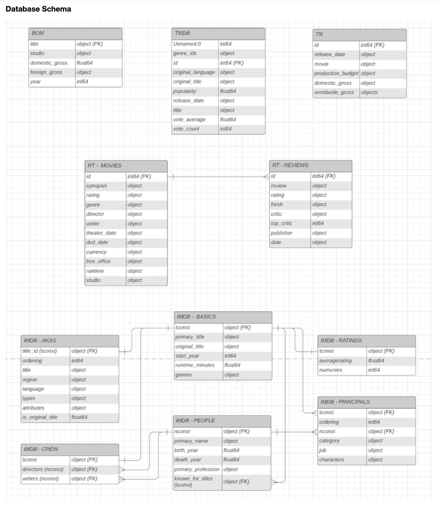
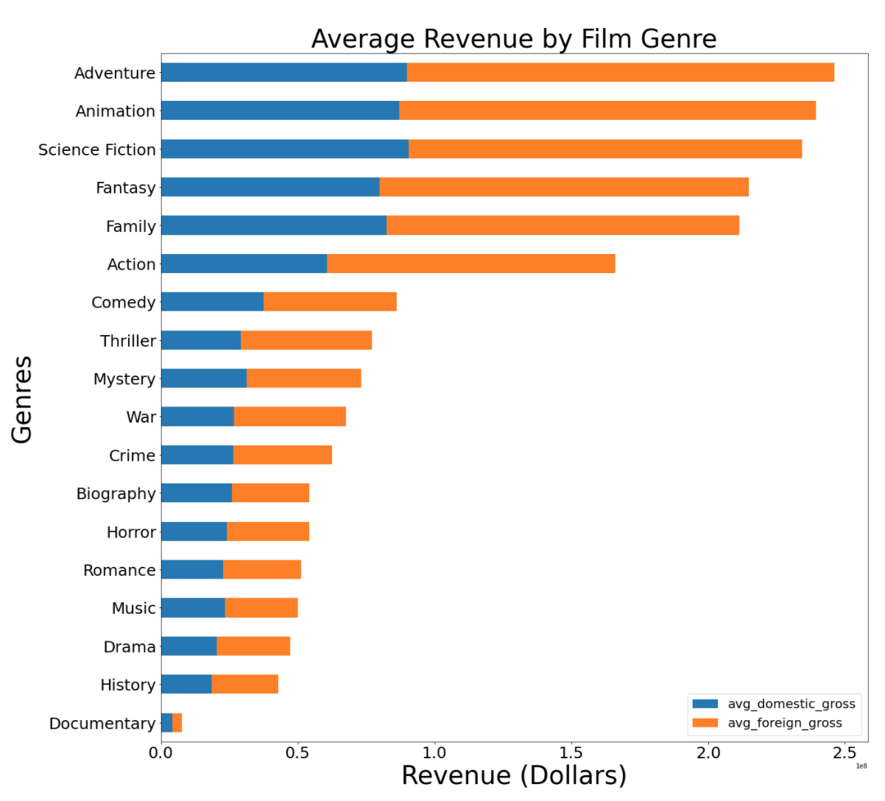
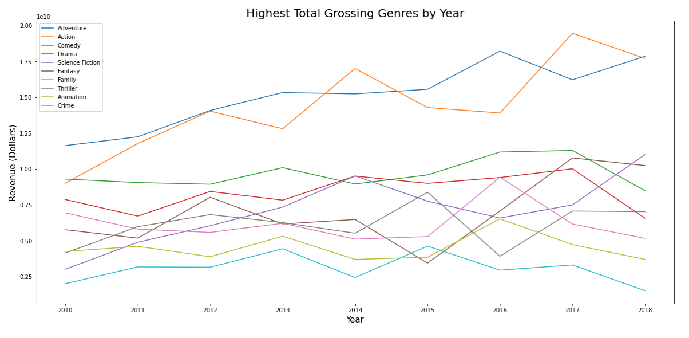

# What Types of Film Do Best at the Box Office?

## Table of contents
* [General Info](#general-info)
* [The Process](#the-process)
* [Screenshots](#screenshots)
* [Languages and Libraries](#languages-and-libraries)
* [Repository Elements](#repository-elements)
* [Contact](#contact)

## General Info
In an alternate universe, Microsoft has built a new movie studio so that they can enter the video content creation market.  To ensure its long term success, they have hired me to determine what types of films are currently doing best at the box office.  In other words, I am seeking to solve a film classification vs. film performance problem. 

## The Process 

I used the OSEMN framework to guide me through the process of solving this problem.  In the obtain step, I gathered film data from from five source databases contained in the 'zippedData' repository.  I then consolidated, formatted, and cleaned the gathered data in the scrub step.  Next, in the explore step, I inspected the scrubbed data and its properties to determine the most important features and potential questions that could be answered.  I also used data visualizations to detect trends and patterns in the data.  This project did not have a true modeling step as I did not seek to fit a model to the data to use for prediction.  Instead, during this step, I first calculated performance metrics to measure and compare the performances of the films in the database.  Then, I sorted the films into classes and determined which classes of film performed best according to my calculated metrics.  In the interpret (last) step, I sought to distill the results of my analysis and prepare them for communication.      

## Screenshots

## Languages and Libraries
* Python 3.7.7
* Pandas 1.0.4
* NumPy 1.18.1
* MatPlotLib 3.2.1
* Requests 3.20.0
* BeautifulSoup 4.9.1

## Repository Elements
1. mod1_proj.ipynb - Jupyter notebook containing film analysis
2. zippedData - Compressed CSV files containing film data
3. rt_titles.pickle - Pickle object used to store intermediate project results
4. module1_project_rubric.pdf - PDF containing project guidelines
5. README.md - Markdown document detailing the project and elements in the repository
6. img - Folder containing screenshot images used in README document
7. presentation.pdf - A non-technical walkthrough of the project and its results

## Contact
Project created by John Nguyen.  Feel free to contact me with any questions, comments, or concerns at jdnguyen91@gmail.com.